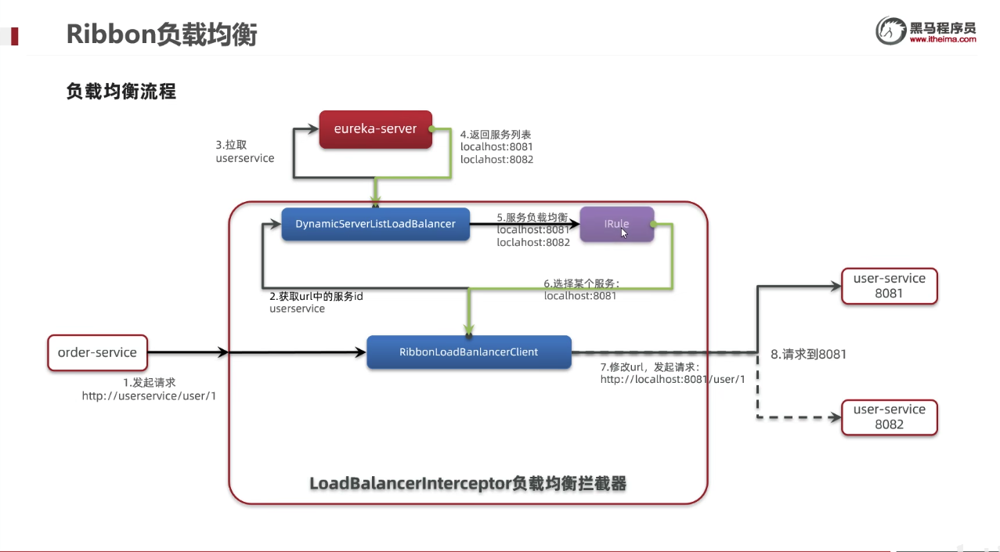
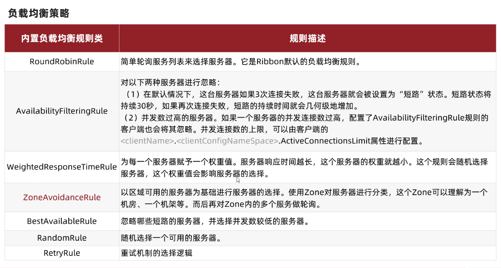
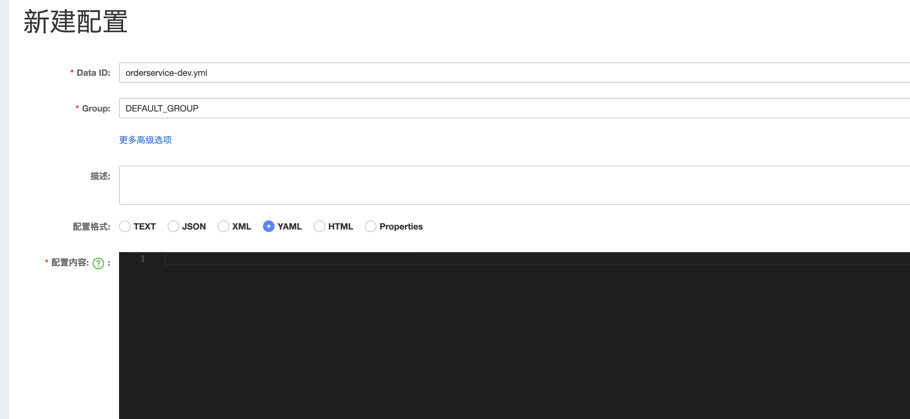
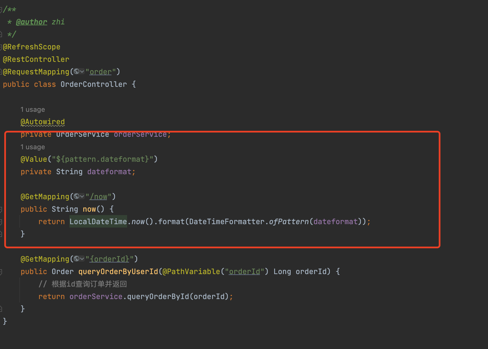

# SpringCloud学习笔记

## Eureka注册中心
``` txt
原理：
	1.服务启动时会向Eureka注册中心注册自身的服务信息，Eureka注册中心会保存这些注册信息，消费者根据服务名称向Eureka拉取提供者信息；
	2.如果存在多个服务提供者，那么服务消费者会玲负载均衡算法，从服务列表中挑选一个进行远程调用；
	3.服务提供者会每隔30秒向EurekaServer发生心跳请求，报告健康状态，eureka会更新记录服务列表信息，心跳不正常会被剔除，这样消费者就可以拉取到最新的信息 
```
------

## Ribbon负载均衡
``` txt
原理：
	1. 服务消费者发出请求，根据服务名称到服务注册中心拉取对应的服务列表信息；
	2. 服务消费者通过Ribbon对服务列表中的服务进行调用，此处使用负载均衡进行调动
```
#### 负载均衡原理

#### 负载均衡策略


------

## Nacos 注册中心

``` txt
启动命令(standalone代表着单机模式运行，非集群模式):
sh startup.sh -m standalone
```

#### nacos启动失败

``` shell
zhi@niuzhigangdeMacBook-Pro logs % cat start.out 
/Library/Java/JavaVirtualMachines/jdk-18.0.2.jdk/Contents/Home/bin/java   -Xms512m -Xmx512m -Xmn256m -Dnacos.standalone=true -Dnacos.member.list= -Xlog:gc*:file=/Users/zhi/work/devloper/devConfig/developerConfig/SpringCloudAliBabaConfig/nacos/logs/nacos_gc.log:time,tags:filecount=10,filesize=102400 -Dloader.path=/Users/zhi/work/devloper/devConfig/developerConfig/SpringCloudAliBabaConfig/nacos/plugins/health,/Users/zhi/work/devloper/devConfig/developerConfig/SpringCloudAliBabaConfig/nacos/plugins/cmdb -Dnacos.home=/Users/zhi/work/devloper/devConfig/developerConfig/SpringCloudAliBabaConfig/nacos -jar /Users/zhi/work/devloper/devConfig/developerConfig/SpringCloudAliBabaConfig/nacos/target/nacos-server.jar  --spring.config.additional-location=file:/Users/zhi/work/devloper/devConfig/developerConfig/SpringCloudAliBabaConfig/nacos/conf/ --logging.config=/Users/zhi/work/devloper/devConfig/developerConfig/SpringCloudAliBabaConfig/nacos/conf/nacos-logback.xml --server.max-http-header-size=524288
错误: 找不到或无法加载主类 
原因: java.lang.ClassNotFoundException: 
```

#### 修改sh脚本(亲测有效)，无需修改Java版本

``` shell

#为原有内容，下面为替换内容, 目的是去除JAVA_OPT_EXT_FIX
# JAVA_OPT_EXT_FIX="-Djava.ext.dirs=${JAVA_HOME}/jre/lib/ext:${JAVA_HOME}/lib/ext"
JAVA_OPT="${JAVA_OPT} -Djava.ext.dirs=${JAVA_HOME}/jre/lib/ext:${JAVA_HOME}/lib/ext"
  
# echo "$JAVA $JAVA_OPT_EXT_FIX ${JAVA_OPT}"
echo "$JAVA ${JAVA_OPT}"
  
# echo "$JAVA $JAVA_OPT_EXT_FIX ${JAVA_OPT}" > ${BASE_DIR}/logs/start.out 2>&1 &
# nohup "$JAVA" "$JAVA_OPT_EXT_FIX" ${JAVA_OPT} nacos.nacos >> ${BASE_DIR}/logs/start.out 2>&1 &

echo "$JAVA ${JAVA_OPT}" > ${BASE_DIR}/logs/start.out 2>&1 &
nohup "$JAVA" ${JAVA_OPT} nacos.nacos >> ${BASE_DIR}/logs/start.out 2>&1 &

```

#### 再次启动

``` shell
zhi@niuzhigangdeMacBook-Pro bin % sh startup.sh -m standalone
/Library/Java/JavaVirtualMachines/jdk-18.0.2.jdk/Contents/Home/bin/java  -Xms512m -Xmx512m -Xmn256m -Dnacos.standalone=true -Dnacos.member.list= -Xlog:gc*:file=/Users/zhi/work/devloper/devConfig/developerConfig/SpringCloudAliBabaConfig/nacos/logs/nacos_gc.log:time,tags:filecount=10,filesize=102400 -Dloader.path=/Users/zhi/work/devloper/devConfig/developerConfig/SpringCloudAliBabaConfig/nacos/plugins/health,/Users/zhi/work/devloper/devConfig/developerConfig/SpringCloudAliBabaConfig/nacos/plugins/cmdb -Dnacos.home=/Users/zhi/work/devloper/devConfig/developerConfig/SpringCloudAliBabaConfig/nacos -jar /Users/zhi/work/devloper/devConfig/developerConfig/SpringCloudAliBabaConfig/nacos/target/nacos-server.jar  --spring.config.additional-location=file:/Users/zhi/work/devloper/devConfig/developerConfig/SpringCloudAliBabaConfig/nacos/conf/ --logging.config=/Users/zhi/work/devloper/devConfig/developerConfig/SpringCloudAliBabaConfig/nacos/conf/nacos-logback.xml --server.max-http-header-size=524288
nacos is starting with standalone
nacos is starting，you can check the /Users/zhi/work/devloper/devConfig/developerConfig/SpringCloudAliBabaConfig/nacos/logs/start.out
zhi@niuzhigangdeMacBook-Pro bin % cat /Users/zhi/work/devloper/devConfig/developerConfig/SpringCloudAliBabaConfig/nacos/logs/start.out
/Library/Java/JavaVirtualMachines/jdk-18.0.2.jdk/Contents/Home/bin/java  -Xms512m -Xmx512m -Xmn256m -Dnacos.standalone=true -Dnacos.member.list= -Xlog:gc*:file=/Users/zhi/work/devloper/devConfig/developerConfig/SpringCloudAliBabaConfig/nacos/logs/nacos_gc.log:time,tags:filecount=10,filesize=102400 -Dloader.path=/Users/zhi/work/devloper/devConfig/developerConfig/SpringCloudAliBabaConfig/nacos/plugins/health,/Users/zhi/work/devloper/devConfig/developerConfig/SpringCloudAliBabaConfig/nacos/plugins/cmdb -Dnacos.home=/Users/zhi/work/devloper/devConfig/developerConfig/SpringCloudAliBabaConfig/nacos -jar /Users/zhi/work/devloper/devConfig/developerConfig/SpringCloudAliBabaConfig/nacos/target/nacos-server.jar  --spring.config.additional-location=file:/Users/zhi/work/devloper/devConfig/developerConfig/SpringCloudAliBabaConfig/nacos/conf/ --logging.config=/Users/zhi/work/devloper/devConfig/developerConfig/SpringCloudAliBabaConfig/nacos/conf/nacos-logback.xml --server.max-http-header-size=524288

         ,--.
       ,--.'|
   ,--,:  : |                                           Nacos 2.0.3
,`--.'`|  ' :                       ,---.               Running in stand alone mode, All function modules
|   :  :  | |                      '   ,'\   .--.--.    Port: 8848
:   |   \ | :  ,--.--.     ,---.  /   /   | /  /    '   Pid: 77711
|   : '  '; | /       \   /     \.   ; ,. :|  :  /`./   Console: http://192.168.31.201:8848/nacos/index.html
'   ' ;.    ;.--.  .-. | /    / ''   | |: :|  :  ;_
|   | | \   | \__\/: . ..    ' / '   | .; : \  \    `.      https://nacos.io
'   : |  ; .' ," .--.; |'   ; :__|   :    |  `----.   \
|   | '`--'  /  /  ,.  |'   | '.'|\   \  /  /  /`--'  /
'   : |     ;  :   .'   \   :    : `----'  '--'.     /
;   |.'     |  ,     .-./\   \  /            `--'---'
'---'        `--`---'     `----'

2022-08-16 22:12:27,273 INFO Bean 'org.springframework.security.access.expression.method.DefaultMethodSecurityExpressionHandler@776802b0' of type [org.springframework.security.access.expression.method.DefaultMethodSecurityExpressionHandler] is not eligible for getting processed by all BeanPostProcessors (for example: not eligible for auto-proxying)
2022-08-16 22:12:27,278 INFO Bean 'methodSecurityMetadataSource' of type [org.springframework.security.access.method.DelegatingMethodSecurityMetadataSource] is not eligible for getting processed by all BeanPostProcessors (for example: not eligible for auto-proxying)
2022-08-16 22:12:27,571 INFO Tomcat initialized with port(s): 8848 (http)
2022-08-16 22:12:27,948 INFO Root WebApplicationContext: initialization completed in 3728 ms
2022-08-16 22:12:31,706 INFO Initializing ExecutorService 'applicationTaskExecutor'
2022-08-16 22:12:31,802 INFO Adding welcome page: class path resource [static/index.html]
2022-08-16 22:12:32,090 INFO Creating filter chain: Ant [pattern='/**'], []
2022-08-16 22:12:32,112 INFO Creating filter chain: any request, [org.springframework.security.web.context.request.async.WebAsyncManagerIntegrationFilter@25214797, org.springframework.security.web.context.SecurityContextPersistenceFilter@baa9ce4, org.springframework.security.web.header.HeaderWriterFilter@147efd9, org.springframework.security.web.csrf.CsrfFilter@3ca17943, org.springframework.security.web.authentication.logout.LogoutFilter@65844c96, org.springframework.security.web.savedrequest.RequestCacheAwareFilter@59262a90, org.springframework.security.web.servletapi.SecurityContextHolderAwareRequestFilter@d9f5fce, org.springframework.security.web.authentication.AnonymousAuthenticationFilter@4e5c8ef3, org.springframework.security.web.session.SessionManagementFilter@dc1fadd, org.springframework.security.web.access.ExceptionTranslationFilter@482a58c7]
2022-08-16 22:12:32,185 INFO Initializing ExecutorService 'taskScheduler'
2022-08-16 22:12:32,206 INFO Exposing 16 endpoint(s) beneath base path '/actuator'
2022-08-16 22:12:32,290 INFO Tomcat started on port(s): 8848 (http) with context path '/nacos'
2022-08-16 22:12:32,293 INFO Nacos started successfully in stand alone mode. use embedded storage
zhi@niuzhigangdeMacBook-Pro bin %  
```

------

#### Nacos服务消费问题①

``` java
08-16 22:42:12:815 ERROR 78460 --- [nio-9091-exec-1] o.a.c.c.C.[.[.[/].[dispatcherServlet]    : Servlet.service() for servlet [dispatcherServlet] in context with path [] threw exception [Request processing failed; nested exception is org.springframework.web.client.ResourceAccessException: I/O error on GET request for "http://userservice/user/1": userservice; nested exception is java.net.UnknownHostException: userservice] with root cause

java.net.UnknownHostException: userservice
	at java.base/sun.nio.ch.NioSocketImpl.connect(NioSocketImpl.java:564) ~[na:na]
	at java.base/java.net.Socket.connect(Socket.java:633) ~[na:na]
	at java.base/java.net.Socket.connect(Socket.java:583) ~[na:na]
	at java.base/sun.net.NetworkClient.doConnect(NetworkClient.java:183) ~[na:na]
	at java.base/sun.net.www.http.HttpClient.openServer(HttpClient.java:498) ~[na:na]
	at java.base/sun.net.www.http.HttpClient.openServer(HttpClient.java:603) ~[na:na]
	at java.base/sun.net.www.http.HttpClient.<init>(HttpClient.java:246) ~[na:na]
	at java.base/sun.net.www.http.HttpClient.New(HttpClient.java:351) ~[na:na]
	at java.base/sun.net.www.http.HttpClient.New(HttpClient.java:373) ~[na:na]
	at java.base/sun.net.www.protocol.http.HttpURLConnection.getNewHttpClient(HttpURLConnection.java:1309) ~[na:na]
	at java.base/sun.net.www.protocol.http.HttpURLConnection.plainConnect0(HttpURLConnection.java:1242) ~[na:na]
	at java.base/sun.net.www.protocol.http.HttpURLConnection.plainConnect(HttpURLConnection.java:1128) ~[na:na]
	at java.base/sun.net.www.protocol.http.HttpURLConnection.connect(HttpURLConnection.java:1057) ~[na:na]
	at org.springframework.http.client.SimpleBufferingClientHttpRequest.executeInternal(SimpleBufferingClientHttpRequest.java:76) ~[spring-web-5.3.22.jar:5.3.22]
	at org.springframework.http.client.AbstractBufferingClientHttpRequest.executeInternal(AbstractBufferingClientHttpRequest.java:48) ~[spring-web-5.3.22.jar:5.3.22]
	at org.springframework.http.client.AbstractClientHttpRequest.execute(AbstractClientHttpRequest.java:66) ~[spring-web-5.3.22.jar:5.3.22]
	at org.springframework.web.client.RestTemplate.doExecute(RestTemplate.java:776) ~[spring-web-5.3.22.jar:5.3.22]
	at org.springframework.web.client.RestTemplate.execute(RestTemplate.java:711) ~[spring-web-5.3.22.jar:5.3.22]
	at org.springframework.web.client.RestTemplate.getForObject(RestTemplate.java:334) ~[spring-web-5.3.22.jar:5.3.22]
	at cn.itcast.order.service.OrderService.queryOrderById(OrderService.java:21) ~[classes/:na]
	at cn.itcast.order.web.OrderController.queryOrderByUserId(OrderController.java:24) ~[classes/:na]
	at java.base/jdk.internal.reflect.DirectMethodHandleAccessor.invoke(DirectMethodHandleAccessor.java:104) ~[na:na]
	at java.base/java.lang.reflect.Method.invoke(Method.java:577) ~[na:na]
	at org.springframework.web.method.support.InvocableHandlerMethod.doInvoke(InvocableHandlerMethod.java:205) ~[spring-web-5.3.22.jar:5.3.22]
	at org.springframework.web.method.support.InvocableHandlerMethod.invokeForRequest(InvocableHandlerMethod.java:150) ~[spring-web-5.3.22.jar:5.3.22]
	at org.springframework.web.servlet.mvc.method.annotation.ServletInvocableHandlerMethod.invokeAndHandle(ServletInvocableHandlerMethod.java:117) ~[spring-webmvc-5.3.22.jar:5.3.22]
	at org.springframework.web.servlet.mvc.method.annotation.RequestMappingHandlerAdapter.invokeHandlerMethod(RequestMappingHandlerAdapter.java:895) ~[spring-webmvc-5.3.22.jar:5.3.22]
	at org.springframework.web.servlet.mvc.method.annotation.RequestMappingHandlerAdapter.handleInternal(RequestMappingHandlerAdapter.java:808) ~[spring-webmvc-5.3.22.jar:5.3.22]
	at org.springframework.web.servlet.mvc.method.AbstractHandlerMethodAdapter.handle(AbstractHandlerMethodAdapter.java:87) ~[spring-webmvc-5.3.22.jar:5.3.22]
	at org.springframework.web.servlet.DispatcherServlet.doDispatch(DispatcherServlet.java:1070) ~[spring-webmvc-5.3.22.jar:5.3.22]
	at org.springframework.web.servlet.DispatcherServlet.doService(DispatcherServlet.java:963) ~[spring-webmvc-5.3.22.jar:5.3.22]
	at org.springframework.web.servlet.FrameworkServlet.processRequest(FrameworkServlet.java:1006) ~[spring-webmvc-5.3.22.jar:5.3.22]
	at org.springframework.web.servlet.FrameworkServlet.doGet(FrameworkServlet.java:898) ~[spring-webmvc-5.3.22.jar:5.3.22]
	at javax.servlet.http.HttpServlet.service(HttpServlet.java:655) ~[tomcat-embed-core-9.0.65.jar:4.0.FR]
	at org.springframework.web.servlet.FrameworkServlet.service(FrameworkServlet.java:883) ~[spring-webmvc-5.3.22.jar:5.3.22]
	at javax.servlet.http.HttpServlet.service(HttpServlet.java:764) ~[tomcat-embed-core-9.0.65.jar:4.0.FR]
	at org.apache.catalina.core.ApplicationFilterChain.internalDoFilter(ApplicationFilterChain.java:227) ~[tomcat-embed-core-9.0.65.jar:9.0.65]
	at org.apache.catalina.core.ApplicationFilterChain.doFilter(ApplicationFilterChain.java:162) ~[tomcat-embed-core-9.0.65.jar:9.0.65]
	at org.apache.tomcat.websocket.server.WsFilter.doFilter(WsFilter.java:53) ~[tomcat-embed-websocket-9.0.65.jar:9.0.65]
	at org.apache.catalina.core.ApplicationFilterChain.internalDoFilter(ApplicationFilterChain.java:189) ~[tomcat-embed-core-9.0.65.jar:9.0.65]
	at org.apache.catalina.core.ApplicationFilterChain.doFilter(ApplicationFilterChain.java:162) ~[tomcat-embed-core-9.0.65.jar:9.0.65]
	at org.springframework.web.filter.RequestContextFilter.doFilterInternal(RequestContextFilter.java:100) ~[spring-web-5.3.22.jar:5.3.22]
	at org.springframework.web.filter.OncePerRequestFilter.doFilter(OncePerRequestFilter.java:117) ~[spring-web-5.3.22.jar:5.3.22]
	at org.apache.catalina.core.ApplicationFilterChain.internalDoFilter(ApplicationFilterChain.java:189) ~[tomcat-embed-core-9.0.65.jar:9.0.65]
	at org.apache.catalina.core.ApplicationFilterChain.doFilter(ApplicationFilterChain.java:162) ~[tomcat-embed-core-9.0.65.jar:9.0.65]
	at org.springframework.web.filter.FormContentFilter.doFilterInternal(FormContentFilter.java:93) ~[spring-web-5.3.22.jar:5.3.22]
	at org.springframework.web.filter.OncePerRequestFilter.doFilter(OncePerRequestFilter.java:117) ~[spring-web-5.3.22.jar:5.3.22]
	at org.apache.catalina.core.ApplicationFilterChain.internalDoFilter(ApplicationFilterChain.java:189) ~[tomcat-embed-core-9.0.65.jar:9.0.65]
	at org.apache.catalina.core.ApplicationFilterChain.doFilter(ApplicationFilterChain.java:162) ~[tomcat-embed-core-9.0.65.jar:9.0.65]
	at org.springframework.boot.actuate.metrics.web.servlet.WebMvcMetricsFilter.doFilterInternal(WebMvcMetricsFilter.java:96) ~[spring-boot-actuator-2.7.2.jar:2.7.2]
	at org.springframework.web.filter.OncePerRequestFilter.doFilter(OncePerRequestFilter.java:117) ~[spring-web-5.3.22.jar:5.3.22]
	at org.apache.catalina.core.ApplicationFilterChain.internalDoFilter(ApplicationFilterChain.java:189) ~[tomcat-embed-core-9.0.65.jar:9.0.65]
	at org.apache.catalina.core.ApplicationFilterChain.doFilter(ApplicationFilterChain.java:162) ~[tomcat-embed-core-9.0.65.jar:9.0.65]
	at org.springframework.web.filter.CharacterEncodingFilter.doFilterInternal(CharacterEncodingFilter.java:201) ~[spring-web-5.3.22.jar:5.3.22]
	at org.springframework.web.filter.OncePerRequestFilter.doFilter(OncePerRequestFilter.java:117) ~[spring-web-5.3.22.jar:5.3.22]
	at org.apache.catalina.core.ApplicationFilterChain.internalDoFilter(ApplicationFilterChain.java:189) ~[tomcat-embed-core-9.0.65.jar:9.0.65]
	at org.apache.catalina.core.ApplicationFilterChain.doFilter(ApplicationFilterChain.java:162) ~[tomcat-embed-core-9.0.65.jar:9.0.65]
	at org.apache.catalina.core.StandardWrapperValve.invoke(StandardWrapperValve.java:197) ~[tomcat-embed-core-9.0.65.jar:9.0.65]
	at org.apache.catalina.core.StandardContextValve.invoke(StandardContextValve.java:97) ~[tomcat-embed-core-9.0.65.jar:9.0.65]
	at org.apache.catalina.authenticator.AuthenticatorBase.invoke(AuthenticatorBase.java:541) ~[tomcat-embed-core-9.0.65.jar:9.0.65]
	at org.apache.catalina.core.StandardHostValve.invoke(StandardHostValve.java:135) ~[tomcat-embed-core-9.0.65.jar:9.0.65]
	at org.apache.catalina.valves.ErrorReportValve.invoke(ErrorReportValve.java:92) ~[tomcat-embed-core-9.0.65.jar:9.0.65]
	at org.apache.catalina.core.StandardEngineValve.invoke(StandardEngineValve.java:78) ~[tomcat-embed-core-9.0.65.jar:9.0.65]
	at org.apache.catalina.connector.CoyoteAdapter.service(CoyoteAdapter.java:360) ~[tomcat-embed-core-9.0.65.jar:9.0.65]
	at org.apache.coyote.http11.Http11Processor.service(Http11Processor.java:399) ~[tomcat-embed-core-9.0.65.jar:9.0.65]
	at org.apache.coyote.AbstractProcessorLight.process(AbstractProcessorLight.java:65) ~[tomcat-embed-core-9.0.65.jar:9.0.65]
	at org.apache.coyote.AbstractProtocol$ConnectionHandler.process(AbstractProtocol.java:890) ~[tomcat-embed-core-9.0.65.jar:9.0.65]
	at org.apache.tomcat.util.net.NioEndpoint$SocketProcessor.doRun(NioEndpoint.java:1789) ~[tomcat-embed-core-9.0.65.jar:9.0.65]
	at org.apache.tomcat.util.net.SocketProcessorBase.run(SocketProcessorBase.java:49) ~[tomcat-embed-core-9.0.65.jar:9.0.65]
	at org.apache.tomcat.util.threads.ThreadPoolExecutor.runWorker(ThreadPoolExecutor.java:1191) ~[tomcat-embed-core-9.0.65.jar:9.0.65]
	at org.apache.tomcat.util.threads.ThreadPoolExecutor$Worker.run(ThreadPoolExecutor.java:659) ~[tomcat-embed-core-9.0.65.jar:9.0.65]
	at org.apache.tomcat.util.threads.TaskThread$WrappingRunnable.run(TaskThread.java:61) ~[tomcat-embed-core-9.0.65.jar:9.0.65]
	at java.base/java.lang.Thread.run(Thread.java:833) ~[na:na]

```

#### 问题①的解决方法

``` pom
原因：SpringCloud2020.0.1.0之后版本不使用netflix了，所以我们不用Ribbon来实现负载均衡。
解决方法：
POM 文件中 "spring-cloud-starter-loadbalancer" 依赖即可
<dependency>
  <groupId>org.springframework.cloud</groupId>
  <artifactId>spring-cloud-starter-loadbalancer</artifactId>
</dependency>

```

------

#### Nacos 与 Eureka 的区别

| 区别                   | Eureka           | Nacos                                                        |
| :--------------------- | :--------------- | :----------------------------------------------------------- |
| 服务注册               | 支持             | 支持                                                         |
| 服务拉取               | 支持             | 支持                                                         |
| 使用心跳机制做健康检测 | 支持             | 支持                                                         |
| 检测方式               | 心跳             | Nacos 支持服务端主动检测提供状态：临时实例采用心跳模式，非临时实例采用主动检测模式 |
| 实例的存在状态         |                  | 临时实例心跳不正常会被剔除，非临时实例则不会被剔除           |
|                        |                  | Nacos支持服务列表变更的消息推送模式，服务列表更新更及时      |
| CAP模式                | Eureka采用AP方式 | Nacos集群默认采用AP方式，当集群中存在非临时实例时，采用CP模式； |

------

## Nacos 配置中心

1. 引入 pom 依赖

   ``` java
   <!-- 配置中心 version 2021.0.1.0 -->
     <dependency>
       <groupId>com.alibaba.cloud</groupId>
       <artifactId>spring-cloud-starter-alibaba-nacos-config</artifactId>
     </dependency>
   ```

2. 修改application.yml 文件

   ``` yaml
   spring: 
     application:
         name: orderservice
     cloud:
   		nacos:
   			config:
   				server-addr: 127.0.0.1:8848
     config:
       import:
         - optional:nacos:orderservice-dev.yml  # 监听 PROVIDER_GROUP :provider-config-dev.yml
        #- optional:nacos:orderservice-dev.yml?group=group_01  # 覆盖默认 group，监听group_01:orderservice-dev.yml
        #- optional:nacos:orderservice-dev.yml?group=group_02&refreshEnabled=false # 不开启动态刷新
         - nacos:orderservice-dev.yml # 在拉取nacos配置异常时会快速失败，会导致 spring 容器启动失败
   ```

3. nacos 配置中心 新增 orderservice-dev.yml 文件,内容写入：pattern:dateformat: yyyy-MM-dd HH:mm:ss #此处忽略格式

   

4. 测试

   

------

